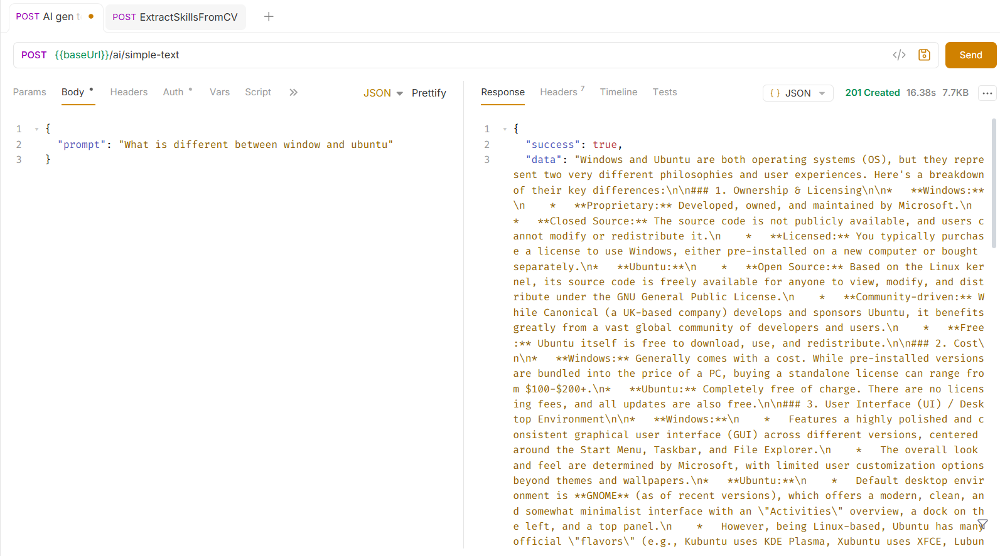
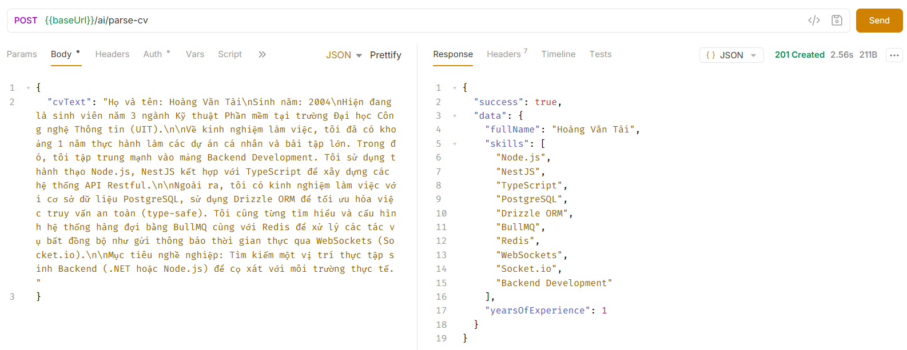

# Tích hợp Gemini AI vào NestJS Backend

## Tổng quan

Tài liệu này ghi lại quá trình tích hợp Google Gemini AI vào hệ thống backend NestJS, bao gồm hai tính năng chính: sinh văn bản tự do và phân tích CV tự động có cấu trúc.

---

## 1. Khởi tạo AiService

Toàn bộ logic giao tiếp với Gemini API được đóng gói trong một service riêng biệt — `AiService` — tuân theo nguyên tắc Single Responsibility. Service này được khởi tạo thông qua vòng đời `OnModuleInit` của NestJS, đảm bảo API key được nạp từ biến môi trường trước khi bất kỳ request nào được xử lý.

Thư viện sử dụng là `@google/genai`, model được chọn là `gemini-2.5-flash`.

---

## 2. Tính năng: Sinh văn bản tự do (`/ai/simple-text`)

Đây là endpoint đơn giản nhất: nhận vào một `prompt` dạng chuỗi văn bản, gọi Gemini API và trả về phản hồi dạng plain text.

**Kết quả thực tế:**

Kết quả trả về là một đoạn phân tích chi tiết, có cấu trúc rõ ràng theo từng mục. Thời gian phản hồi ghi nhận khoảng **16 giây** với dung lượng response ~7.7KB, phản ánh độ phức tạp của câu hỏi và mức độ chi tiết trong câu trả lời.

---

## 3. Tính năng: Phân tích CV có cấu trúc (`/ai/parse-cv`)

Đây là tính năng nổi bật hơn, khai thác khả năng **Structured Output** của Gemini thông qua `responseMimeType: 'application/json'` và `responseSchema`. Thay vì nhận về một đoạn văn bản thô, API trả về dữ liệu JSON đã được định nghĩa sẵn schema gồm ba trường:

- `fullName` — Họ tên ứng viên
- `skills` — Danh sách kỹ năng/công nghệ
- `yearsOfExperience` — Số năm kinh nghiệm (ước tính)

**Kết quả thực tế:**

Với đoạn CV đầu vào là văn bản thuần tiếng Việt, model đã trích xuất chính xác:
- Họ tên: **Hoàng Văn Tài**
- Kỹ năng: Node.js, NestJS, TypeScript, PostgreSQL, Drizzle ORM, BullMQ, Redis, WebSockets, Socket.io, Backend Development
- Số năm kinh nghiệm: **1**

Thời gian phản hồi là **2.56 giây** — nhanh hơn đáng kể so với tác vụ sinh văn bản dài, do output được giới hạn trong một schema cố định.

---
